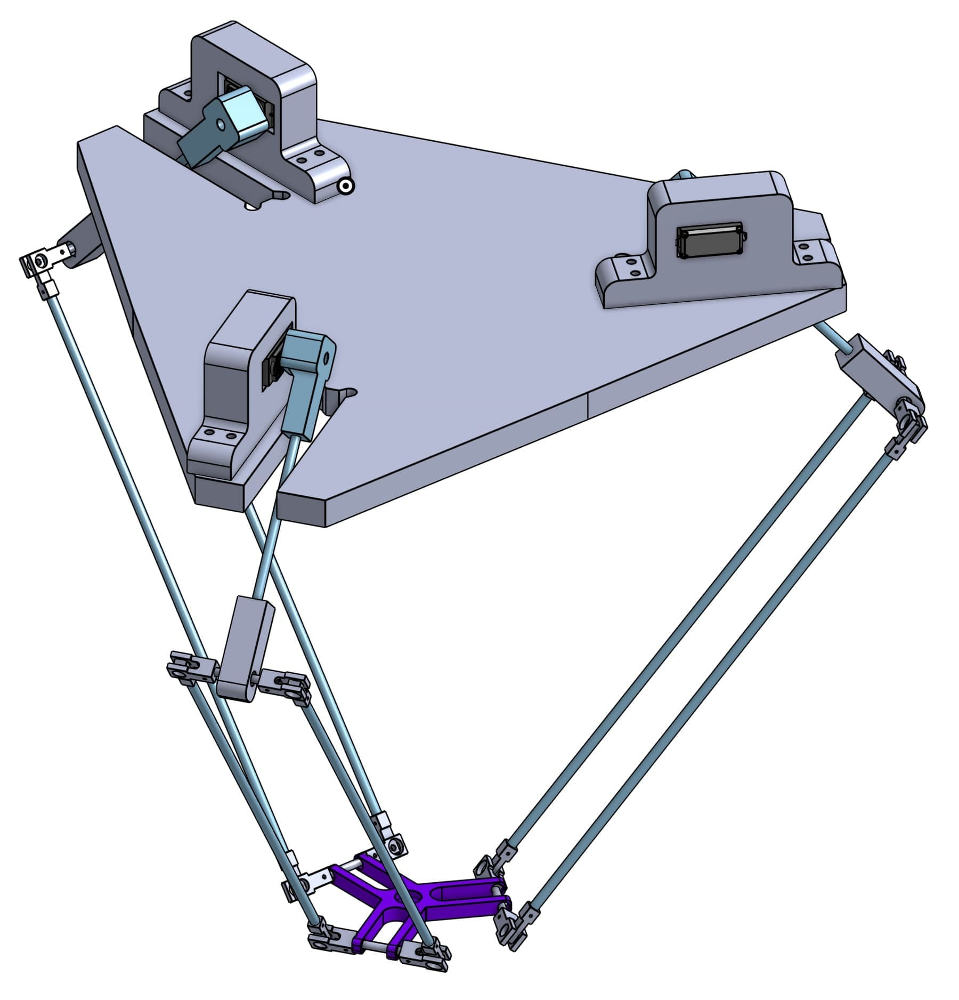
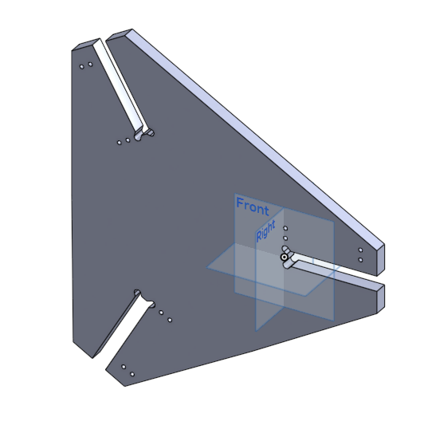
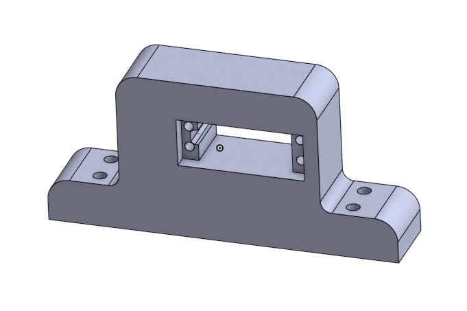
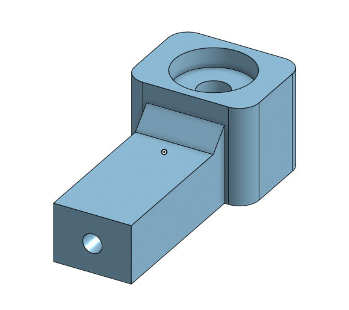
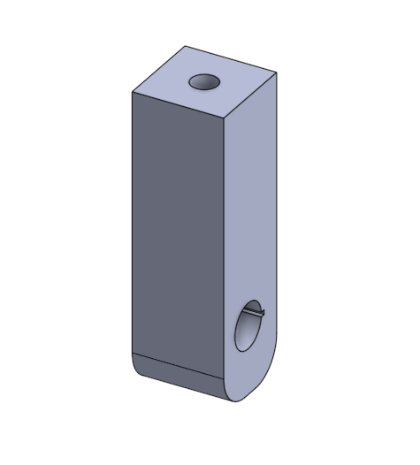
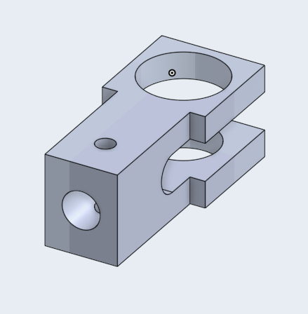
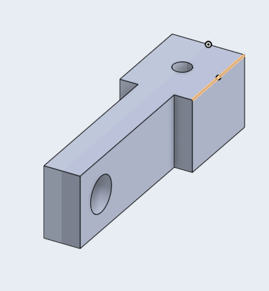
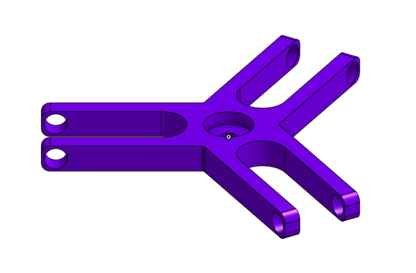

# 3D Parts of the Delta Robot
This repository contains the CAD files for the three-dimensional parts used in the construction of the Delta robot described in the article "A Low-Cost Delta Robot for Educational Robotics."

## Parts Development
The robot parts were based on Halit Şahin’s publicly available project, accessible at https://grabcad.com/library/delta-robot-23. Modifications were made to adapt the design to the specific requirements of the robot proposed in the article.

## Assembling the robot
The image below shows the fully assembled 3D model of the Delta robot. Threaded rods were used for the arms in the physical construction of the robot.

## 3D Printed Parts

### Upper Base

##### Quantity: 1

### Servomotor Base 

##### Quantity: 3

### Servomotor Arm Connector

##### Quantity: 3

### Arm Connector

##### Quantity: 3

### External Fitting

##### Quantity: 12

### Internal Fitting

##### Quantity: 12

### Lower Base

##### Quantity: 1
